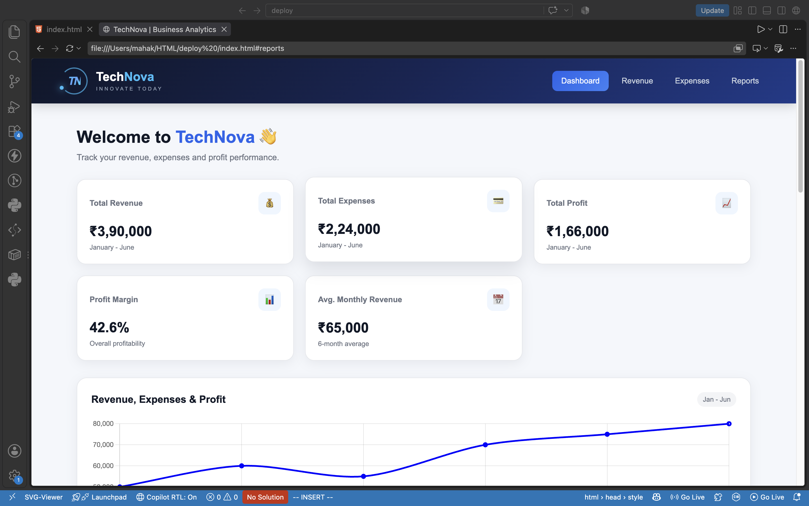
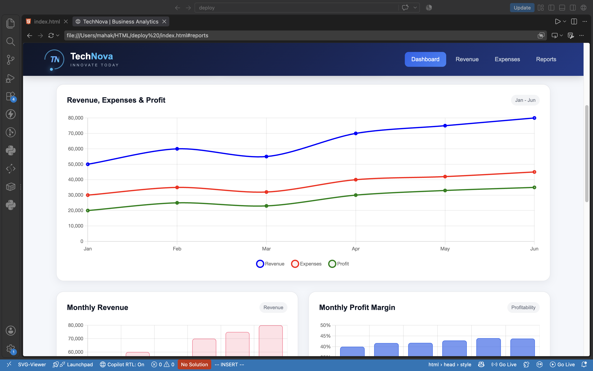
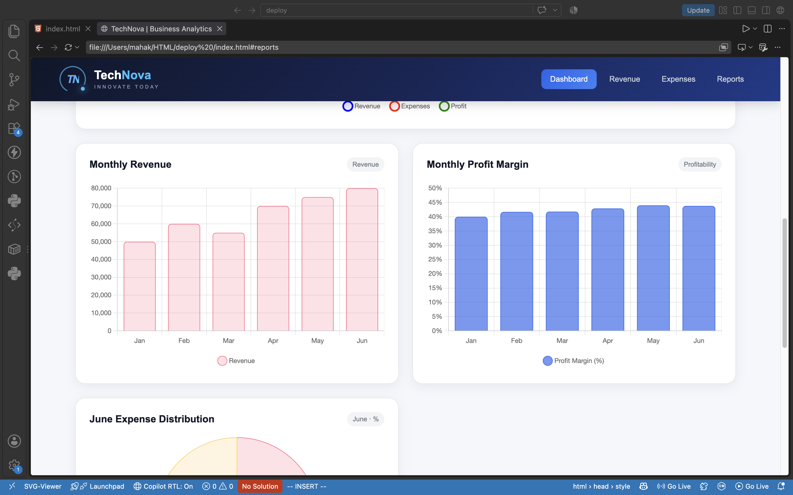
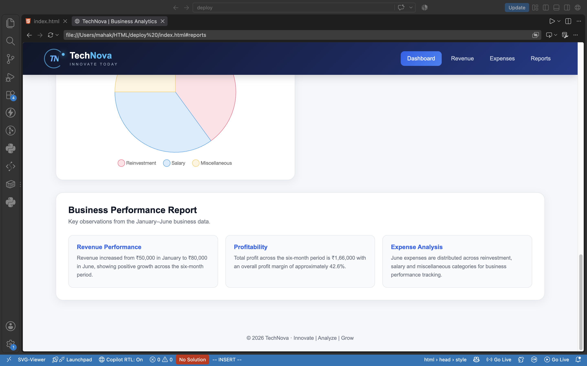

## 📸 Dashboard screenshots

### 🏠 Dashboard overview

### 📈 Revenue, expenses & profit performance

### 📊 Monthly revenue & profit margin

### 💰 June expense distribution

### 📋 Business performance report

## 🛠️ Technologies

- HTML5

- CSS3

- JavaScript

- Responsive web design

- Data visualization

## 🚀 How to run

1. Clone or download this repository

2. Open the project folder

3. Open the `index.html` file in your browser

4. No additional steps are required

This project was created to demonstrate the application of front-end web development and data visualization knowledge in creating an interactive business dashboard.

The dashboard contains the following reports:

- Revenue, expenses, profit, and profit margin

- Monthly revenue, profit, and expense distribution

- Business performance report
